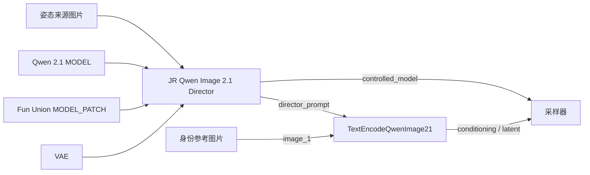

# JR Qwen Image 2.1 Director：Fun ControlNet Union 集成研究

核查日期：2026-09-28。本文保留首次研究时的判断；后续用户已授权将 PR 支持回移植到项目。
v0.3.0 已实现项目内兼容层并进行 INT8 本机推理；最终用法见 README，实测见 [验证记录](CONTROLNET_VALIDATION.md)。
下面关于“尚未加载”“拟采用”的内容为实施前记录。

## 结论

可以融合到 Director，最有价值的是将编辑后的骨架作为 Pose ControlNet 条件。图片导入、人物选择、3D 编辑沿用现有流程，生成时增加结构约束。

当前生产环境 ComfyUI 0.37.0（`8d534945`）、frontend 1.53.6 尚无此模型的专用实现。对应上游 [PR #16519](https://github.com/Comfy-Org/ComfyUI/pull/16519) 核查时仍为 open、未合并，审阅版本为 `b0ab6a4c662a2e63fe2c0d7779dd06aeb62df3cf`。更新到普通主线不等于获得此支持。

## 模型与兼容性

- [官方模型](https://huggingface.co/alibaba-pai/Qwen-Image-2.1-Fun-Controlnet-Union) 支持 Pose（DWPose）、Depth、Canny 等八种结构条件及局部重绘；权重只含控制分支，仍需 Qwen Image 2.1 基础模型。
- 新结构包含 16 个控制块，注入基础模型的第 0、2、…、30 层；控制输入宽度为 129。本机已有的旧 Qwen Fun / InstantX 控制实现不能代替它。
- 审阅的 ComfyUI 实现通过 `MODEL_PATCH` 修改 `MODEL`，不是传统的 `CONTROL_NET → CONDITIONING` 接线。
- 官方 BF16 文件约 7.55GB；PR 作者提供 [INT8 convrot 测试权重](https://huggingface.co/Kijai/QwenImage_experimental/tree/main/model_patches)，约 3.78GB。它属于实验转换版本，不应把文件大小当作运行显存需求。
- [模型许可证](https://huggingface.co/alibaba-pai/Qwen-Image-2.1-Fun-Controlnet-Union/raw/main/LICENSE) 为 Qwen Research License，与本项目代码许可证分别适用。

## 拟采用的节点接口

主节点显示名称保持 **JR Qwen Image 2.1 Director**，内部 ID 保持 `QwenImage21Director`。

| 新接口 | 用途 |
|---|---|
| 可选 `model` / MODEL | 输入 Qwen Image 2.1 基础模型 |
| 可选 `vae` / VAE | 将 Director 姿态图编码为控制条件 |
| 可选 `control_patch` / MODEL_PATCH | 输入加载后的 2.1 Fun Union 权重 |
| 启用、强度、开始比例、结束比例 | 控制是否施加约束及其范围 |
| 追加 `controlled_model` / MODEL 输出 | 接现有采样器 |

保留现有六个输出的索引，默认关闭 ControlNet，已有摆姿态和图片导入工作流继续使用。应在执行时检查模型类型与后端能力，缺少支持时给出明确错误，不能悄悄退回无控制生成。

Director 内部用最终摄影机投影的姿态图施加控制，编辑预览不触发权重加载或推理。身份参考仍走 Qwen 编码器的 `image_1`；姿态来源和身份参考可以不同。

启用 ControlNet 时需要相应调整提示词，不能仍强制宣称姿态在 `<image2>`。不把编码器输出的 conditioning 接回 Director，否则会与 Director 的 prompt 输出形成图循环。

## 实施及验收顺序

1. 在隔离测试环境验证上述 PR 与现有 INT8 基础模型；成功后再决定生产后端升级或局部兼容适配。直接复制上游实现还需保留相应许可证与来源。
2. 先用现有 `pose_control` 做接口验证；检查 DWPose 身体连线、颜色和裁切兼容性。现有骨架不含完整手指和面部关键点，不能宣称具备精细手势控制。
3. 对同一参考图、种子、提示词和尺寸进行对照：原双参考图、仅 ControlNet 姿态、两者结合。优先测试此前不稳定的行走、举手、背面及不对称姿态。
4. RTX 3060 12GB 先测 INT8、512 尺寸，再测 768/1024；记录峰值显存、内存、耗时和关节偏差。强度从 0.5、0.75、1.0 比较，不能只确认“成功出图”。
5. 验证开关及强度为零、连续运行不同姿态、尺寸变化、工作流保存重载和缺少权重的报错，然后交付完整示例工作流。

## 已知限制与待验证点

- 控制分支增加显存与计算量。64GB 内存有利于卸载，但 12GB 显卡能否稳定运行及速度尚无本机实测结论。
- 当前 Qwen 2.1 Core 在存在相关 block patch 时会禁用前缀 KV cache；PR 在控制区间外尝试恢复缓存。原有缓存加速收益需要重新测量。
- Pose 约束主要作用于二维关节布局；骨架投影相似的正背面、遮挡、面部朝向仍需提示词和图像条件配合。不能保证绝对姿态、身份或手脚正确率。
- Depth 可作为后续方向，但现有 Director 的简化骨架不是人体表面，不能将其深度直接视为可靠的人体深度控制图。

此次研究未更改生产 Core、未重启服务、未下载控制权重；现有 Director 运行逻辑未变。
