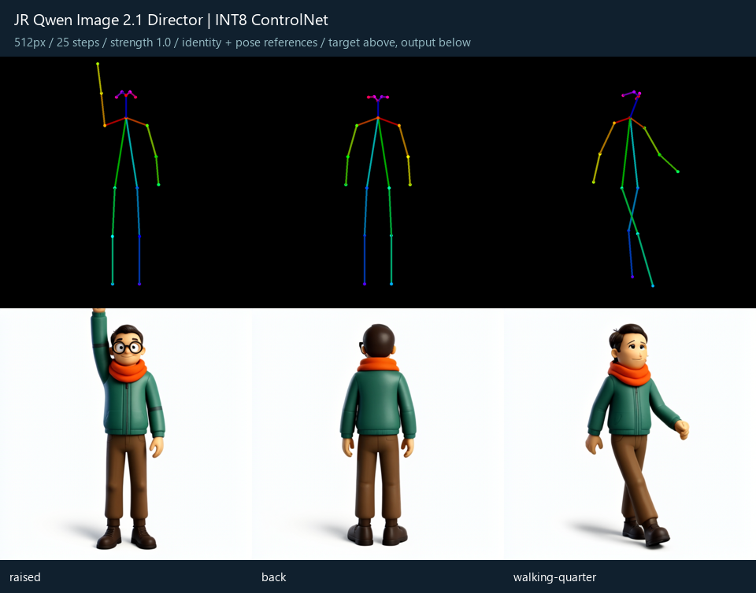
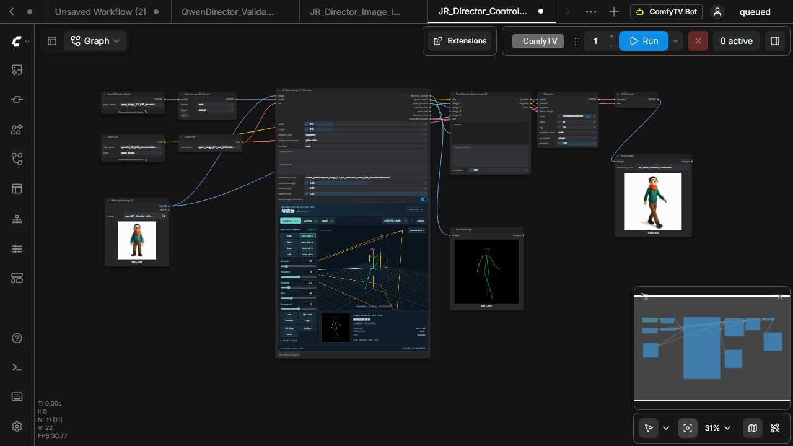

# JR Qwen Image 2.1 Director v0.3.0 ControlNet 验证

日期：2026-09-28。目标：ComfyUI 0.37.0 / `8d534945`、frontend 1.53.6、RTX 3060 12GB、64GB 系统内存。
Core 工作区未修改，仍由既有 `ComfyUI 3060 Production` 计划任务运行。

## 来源和实现

- 回移植 [ComfyUI PR #16519](https://github.com/Comfy-Org/ComfyUI/pull/16519)，固定在 `b0ab6a4c662a2e63fe2c0d7779dd06aeb62df3cf`。
- 权重：[Kijai INT8 convrot](https://huggingface.co/Kijai/QwenImage_experimental/tree/0498775/model_patches)，3,779,298,944 字节。
- 下载后完整 SHA256 校验通过：`07aa961570ac0e03d4ca936aecd76854d077a33cde69b5092399afba01b3715d`。
- 独立控制模块继承本机 Qwen 2.1 block；使用 CoreModelPatcher 管理 INT8、动态显存和卸载。
- 旧 Core 的缺少参数问题通过模型克隆的 `_forward` 对象补丁补齐；没有磁盘 Core 修改或模块级 monkey patch。
- 严格检查 16 个控制块、129 通道、4096 hidden size，并严格加载 state dict，避免错误文件静默失效。
- 主节点内部加载权重、渲染最终姿态并应用控制；没有新增独立推理服务。

## 回归测试

- 原 Python 测试 13 项通过；前端测试 6 项通过；TypeScript 与 Vite 构建通过。
- `scripts/test_controlnet_runtime.py` 四项真实 Core/CPU 测试通过：错误权重拒绝、参数边界和提示词、克隆补丁安装/恢复、区间外原补丁保留及异常清理。
- 连续执行不同姿态及不同分辨率通过；控制权重在一次进程内复用，渲染和模型应用按节点输入重新计算。

## 首批本机推理

基础模型和文字编码器均为现有 Qwen 2.1 INT8 convrot，Qwen 2.1 VAE，seed 21001、CFG 1、Euler/simple、25 步。
使用项目自有的穿衣玩偶参考图。下表首批仅有身份图 + ControlNet，没有 `image_2`。

| 测试 | 分辨率 | 强度 | 总耗时（秒） | 整卡显存采样最大值（MiB） | 观察 |
|---|---:|---:|---:|---:|---|
| 正面行走，首轮 | 512 | 0.75 | 40.3 | 未全程记录 | 出图成功，腿部仍接近站姿 |
| 同提示词、同种子零控制 | 512 | 0 | 18.8 | 11138 | 旁路成功，未施加控制 |
| 举手 | 512 | 0.75 | 35.5 | 11394 | 手臂抬起，但弯曲程度与目标不同 |
| 背面 | 512 | 0.75 | 37.5 | 11274 | 未成功转成背面 |
| 不对称 | 1024 | 0.75 | 121.0 | 11442 | 出图成功，双臂有变化，手部仍有缺陷 |

耗时包含编码、采样和解码，缓存和加载状态不同，不是统一冷启动基准。
显存由 `nvidia-smi` 每约两秒采样，包含整卡其他进程和常驻缓存，可能错过瞬时峰值。
这些数据证明本机可运行，并不证明姿态绝对准确；实际画质观察促使默认示例保留双参考图并添加 ControlNet。

## 双参考图 + ControlNet

相同基础设置，身份图接 `image_1`，姿态图同时接 `image_2` 和内部 ControlNet，强度 1.0。

| 测试 | 分辨率 | 总耗时（秒） | 整卡显存采样最大值（MiB） | 观察 |
|---|---:|---:|---:|---|
| 举手 | 512 | 53.0 | 11186 | 手臂伸直抬起，但手掌仍被画面上沿裁切 |
| 背面 | 512 | 50.0 | 11442 | 成功转为背面 |
| 斜侧行走 | 512 | 50.1 | 11442 | 转为斜侧行走，腿部前后关系仍是模型推断 |
| 举手，控制区间 0.2–0.8 | 512 | 43.8 | 11218 | 中途开启与关闭控制均正常完成 |

不同参考接线同时改变了图像条件和提示词，不能将其改善全部归因于 ControlNet。
512 数据来自双参考图；上述 1024 数据来自单参考图，不能直接用来估计双参考图 1024 的耗时。

实际浏览器中，旧图片导入工作流恢复为 `disabled`，原姿态保持；新示例的权重、强度和双参考开关显示正常。
通过界面将姿态改为 Walking、方位角改为 45° 后，用工作流菜单保存，已在落盘 JSON 中核对其状态及控制参数。
完整 UI 工作流成功完成，prompt ID `f281de5b-4129-4413-9f5c-a3dda824206f`，输出 `JR_Qwen_Director_ControlNet_00001_.png`。
最后检查：旧版最小工作流无需模型即可成功运行；开启控制但未连接 MODEL/VAE 时立即给出明确错误，队列可继续执行。





## 重现

```powershell
python scripts/test_controlnet_runtime.py --comfy-root '你的 ComfyUI 路径'
python scripts/generation_test.py --reference qwen21_director_reference_20260928.png --case raised --control --dual-reference --strength 1 --steps 25 --tag raised-dual-cn100
```

脚本在队列忙时拒绝提交，测试请求、history 和指标写入忽略的 `.local`，生成图写到 ComfyUI output 的 `Qwen21Director_test`。
BF16 加载路径按上游实现保留，但没有下载 BF16 或测量其本机性能。精细手指、面部和人体表面深度不在此版范围内。
