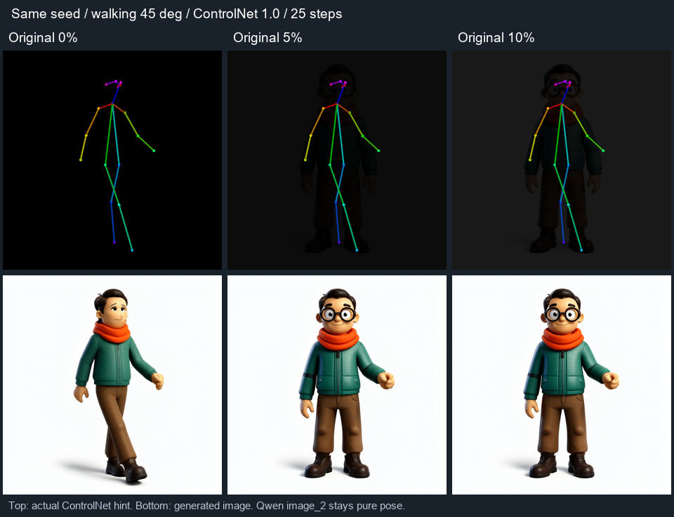

# Pose + RGB / Depth 调研与实验

日期：2026-09-29。目标是提高修改后的姿态与摄影机控制，而非仅复制参考图。

## GitHub 上实际能确认什么

- [ComfyUI-OpenPose](https://github.com/alessandrozonta/ComfyUI-OpenPose/blob/main/openpose_node.py) 同时输出带关键点的原图和黑底关键点图，并提供透明度参数。它证明叠加实现存在，**不证明 5%–10% 原图对 Qwen 2.1 必然更有效**。
- [OpenPose Studio](https://github.com/andreszs/ComfyUI-OpenPose-Studio/blob/main/docs/README.md) 有可调背景参考图透明度；这是编辑器背景功能，不能当作 ControlNet 推理效果的证据。
- [Jakkanna Pose Studio](https://github.com/teenu/ComfyUI-Jakkanna) 的 [Qwen 工作流](https://github.com/teenu/ComfyUI-Jakkanna/blob/main/workflows/Jakkanna%20Pose%20Studio%20QWEN.json) 将 Pose Studio 的渲染图和角色参考图分别接入生成子图。说明完整三维身体渲染值得参考；它不是本项目使用的 2.1 Fun Union 多控制验证。
- [Qwen 2.1 Fun Union 模型卡](https://huggingface.co/alibaba-pai/Qwen-Image-2.1-Fun-Controlnet-Union) 列出 Pose、Depth 等八类控制。[官方训练入口](https://github.com/aigc-apps/VideoX-Fun/blob/main/scripts/qwenimage21_fun/README_TRAIN.md) 以单个 `control_file_path` 提供控制图。支持多种输入类型不等于自动估深，也不等于随意混合两类像素经过训练。
- [Diffusers 的 QwenImageMultiControlNetModel](https://github.com/huggingface/diffusers/blob/main/src/diffusers/models/controlnets/controlnet_qwenimage.py) 展示了复用 Union 权重、各条件分别前向、再求和残差的做法。它针对不同的 Qwen 控制架构，只是本项目后续独立姿态/深度分支的设计参考。

## 已实现的实验选项

`reference_opacity=0 / 0.05 / 0.10`。0 精确保持原来的控制图；非零需要 `image`。
原图等比例居中适配、取第一帧，作为暗背景；保留彩色骨架。新增末尾输出 `control_image` 反映内部 ControlNet 的真实输入。
独立的 `pose_control` 与默认工作流接线保持纯骨架。此实验不修改输入照片的动作或视角，也不执行深度估计。

## 本机同种子对照



RTX 3060 12GB；Qwen Image 2.1 INT8 + Fun Union INT8；512 × 512、25 步、CFG 1、Euler/simple；
Walking 预设、相机方位角 45°、ControlNet 强度 1、区间 0–1。三次使用同一 `examples/reference.png` 木偶参考、相同种子与提示词。
Qwen 编码器仍以原图为 image_1、纯骨架为 image_2；仅内部 ControlNet 的原图叠加强度改变。

| 原图强度 | 完成耗时 | 人工观察 |
|---|---|---|
| 0% | 52.4 秒 | 侧身、双腿交叉迈步；眼镜身份细节丢失 |
| 5% | 50.2 秒 | 眼镜与原图外观更稳定，但变回近正面站立，未遵循目标行走姿态 |
| 10% | 51.9 秒 | 同样偏回正面站立，未见比 5% 更好的目标姿态控制 |

**此例不支持“5%–10% 原图使新姿态控制更强”**。它更像增强来源图约束，也将来源图姿态带回来。
这是一个参考、一种姿态、一个种子的定性对照，不能推断全部照片、动作或采样设置。未测试将叠加图同时送入 image_2，也未测试深度条件。

复现（在 ComfyUI venv 中，且参考图已放入 input）：

```powershell
python scripts/generation_test.py --reference qwen21_director_reference_20260928.png --case walking-quarter --control --dual-reference --strength 1 --reference-opacity 0.05 --steps 25 --tag walking-quarter-overlay005
```

分别将 opacity 改为 0、0.05、0.10，并使用各自唯一 tag。测试脚本保存实际控制图和输出图，`.local` 保存请求、历史和采样显存记录。
18 个 Python 检查（含 5 个 Core 运行时检查）、6 个前端测试及前端构建通过；三档实际推理均完成。

## 深度的实现判断

这里需要的是 **depth 深度图（远近/遮挡关系）**，不是相机景深虚化。
ControlNet 消费控制图；从照片估计深度需要额外预处理器，例如 [Depth Anything V2](https://github.com/DepthAnything/Depth-Anything-V2)。
本机已发现 `models/depthanything/depth_anything_v2_vitl_fp16.safetensors`，但当前服务没有注册可直接调用的 Depth Anything 节点。

建议区分两种任务（以下是设计判断，尚未实现）：

1. **保持源图姿态/布局**：导入时同时估计源图深度，作为可选结构条件。单目相对深度并不是可靠的真实尺度或精确关节深度。
2. **编辑动作或摄影机**：应让身体表面与骨架一起改变，用同一摄影机重新渲染目标深度。当前简单骨架没有衣服、完整身体表面和背面信息，需要增加有厚度的人体代理网格；不能把骨骼 Z 值涂灰就冒充完整深度图。

姿态与深度应有独立强度/控制区间。两个控制流应从相同的未修改模型输入初始化，再合并残差；不能简单嵌套两次当前单条件补丁。共享权重可避免复制权重，但额外分支仍增加计算和激活内存，需要 RTX 3060 实测。
当目标动作不同于来源图时，直接沿用来源图深度或原图像素可能相互竞争。因此当前保留默认纯姿态控制，未将自动估深或多控制分支标记为完成。
