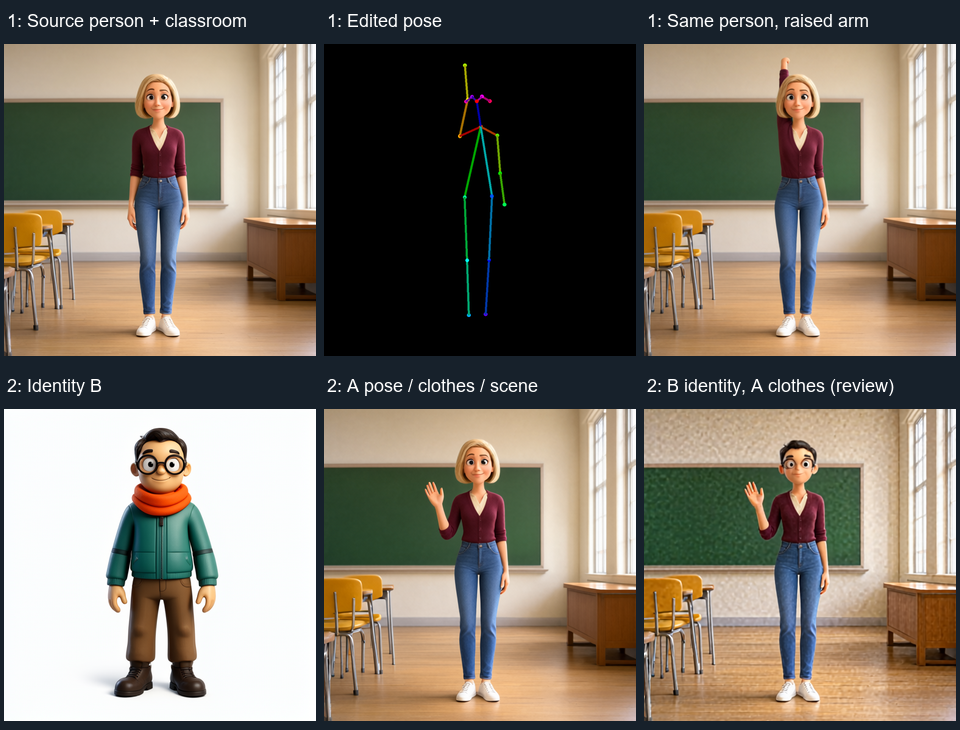

# 两种场景的实际验证

2026-09-29，ComfyUI 0.37.0 / frontend 1.53.6，RTX 3060 12GB。
Qwen Image 2.1、文本编码器、Fun Union 均使用当前 INT8 权重。测试素材为专门生成的动画角色，不是真实人物数据集。

## 参考图分工

| 任务 | 身份 | 服装 | 场景、相机 | 姿态 |
|---|---|---|---|---|
| edit_pose | source | source | source | 从 source 导入后编辑 |
| replace_person / identity_only（默认） | B / `<image1>` | A / `<image2>` | A / `<image2>` | 从 A 导入，可继续编辑 |
| replace_person / full_appearance | B / `<image1>` | B / `<image1>` | A / `<image2>` | 从 A 导入，可继续编辑 |

`image` 始终是姿态导入和淡叠加的来源；替换模式下是 A / `<image2>`。
`identity_image` 只在替换模式使用，是 B / `<image1>`。
两个新增模式的参考图输出先适配到 Director 画布；编码器使用 `resolution=0`。

## 场景 1：同人物、同教室，举起手

从 `jr_director_classroom_source.png` 检测单个人物并拟合，拟合误差 1.66 像素；保留其相机/位置，只修改右肩和右肘。

- 控制强度 1、区间 0–1，完整原图 + 骨架双参考：背景丢失、肢体错误，不采用。
- 控制强度 0.65、区间 0–0.8，仅原图参考：仍出现背景/肢体问题，不采用。
- **控制强度 0.25、区间 0–0.6，原图 + 编辑骨架：保留教室和人物，右臂举起。** 512、25 步、CFG 1、Euler/simple，38.31 秒。

示例已经保存这组导入后的编辑状态；换图后必须重新点击导入，不能沿用教室示例的骨架坐标。

## 场景 2：保留 A 的衣服/动作/场景，用 B 的身份替换

场景参考 `jr_director_classroom_raised.png` 是由原生单图编辑得到的教室举手图；不把早期失败的白底图当作场景参考。
检测拟合误差 1.75 像素。B 为项目原有短黑发动画男性参考。

- 泛化的身份替换指令，配合 0% 或 5% 淡叠加、两张或三张参考图，曾仍输出原人物。不能把“运行完成”当作替换成功。
- 明确描述 B 的外观后，完整外观替换能转移 B 的衣服与身份；这不是用户最终选择的训练目标。
- **最终 identity_only 示例**：明确 B 的短黑发男性身份、A 的酒红开衫/蓝色牛仔裤/白鞋与举手动作；强度 0.25、区间 0–0.6，5% 的 A 原图淡叠加。编码器接 B 身份和完整 A 场景，骨架仅经过内部 ControlNet。42.23 秒。
- 最终图保留 A 的衣服、举手和教室，迁移了 B 的脸/发型特征。身体比例、脸部一致性、手部质量和背景纹理仍需审核，不能据此宣称身份 IP 已精确保真。

以上 v0.4.0 验证曾使用素材专用的 `prompt_prefix`；它不是自动识别结果。
v0.4.1 按用户要求去掉这段专用描述，两个示例的前后缀均留空，默认由 Director 生成通用规则：身份、衣物和场景使用 `<image1>` / `<image2>` 图像引用，动作遵循最终骨架，不写死性别、发型、衣服颜色、教室或举手。
修改后的骨架优先于来源图动作；不再将单目拟合中不可靠的躯干角度描述附加到这两个场景的提示词。
上面的历史结果不能作为新提示词在多数人物上的成功率证明；换图默认可不改提示词，仍需按候选图流程筛选。
本次 v0.4.1 通用提示词实测（相同演示素材、种子 21003）：

- 场景 1：42.33 秒，保留原人物、服装和教室，右臂抬起；输出 `JR_Director_edit_pose_00001_.png`。
- 场景 2：40.26 秒，仍为原人物，身份替换失败；输出 `JR_Director_replace_person_00007_.png`。
- 场景 2 另试简短英文与通用中文，38.25 / 40.23 秒，仍未替换身份；未将这两种变体作为默认模板。

因此当前完成的是通用提示词与引用格式统一，尚未证明场景 2 能靠这套通用提示词稳定替换身份。
本次没有在完全相同最终提示词下证明 5% 比 0% 更好。批量入口默认叠加 0；5% 是可测试选项。

共 29 项自动检查通过（17 个 Python、6 个 Core 运行时、6 个前端测试），前端构建成功。
批量脚本以项目素材完成了一张自动提姿态、上传、推理、下载、清单追溯的真实测试；该样本服装/动作错误，已标记 rejected。
这证明批量流程可执行，不证明它能无人审核地制作合格身份 LoRA 数据集。

## 训练数据边界

这些是少量单人卡通素材、单种子的定性测试；并未验证真实人物、大量侧背面、多人或复杂遮挡数据集。
姿态拟合是近似 2D-to-3D，单张图不能恢复可靠的真实体型和隐藏部位。对身份 LoRA，生成图应进入待审核集合；审核身份、服装来源、姿态、手部和视角后再制作标签。
深度估计与独立深度控制分支尚未接入。场景 2 中 A 的深度与 A 的目标动作一致，值得进一步测试；但深度也可能保留 A 的体型，因此不能视为自动保持 B 体型的方案。
