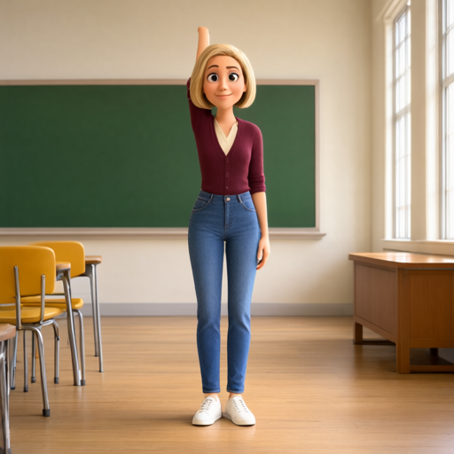
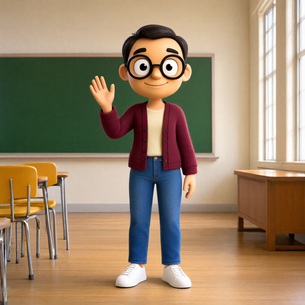

# 两种场景：官方 ControlNet 与组合验证（v0.6.0）

2026-09-29。生产 Core `a7169322`，版本号仍为 0.37.0；frontend 1.53.6、comfy-kitchen 0.2.36，RTX 3060 12GB。
基础模型、文本编码器与 Fun Union 均使用本机 INT8 ConvRot；512×512、25 步、Euler/simple。
素材仍为项目自有的单人动画角色，并非用户真实 IP 数据集。

## 结论与默认配置

| 项目 | 场景 1：原人物、原场景改动作 | 场景 2：B 身份，A 服装/姿态/场景 |
|---|---|---|
| 默认工作流 | `example/JR Director - Scene 1 Edit Pose.json` | `example/JR Director - Scene 2 Replace Identity.json` |
| CFG | 1 | 3 |
| Fun Union | 强度 0.25，区间 0–0.6 | 强度 0.25，区间 0–0.6 |
| 编码器图像 | `<image1>` 原图，`<image2>` 编辑后的骨架 | `<image1>` B，`<image2>` 完整 A 场景；骨架仅经 ControlNet |
| 原图淡叠加 | 0 | 0.05；0 与 0.10 同样可试，未证明 0.05 更优 |
| 自动描述 | 关闭 | 开启；复用 Qwen3-VL，输出描述供检查 |
| 深度 / AnyAngle | 默认关闭 | 默认关闭，深度为可选对照；AnyAngle 未带来本次任务收益 |

两套默认的前后缀均留空。新素材重新导入姿态，不需要把默认提示词中的人物、衣服或场景逐个改写。
场景 2 的关键改善来自**自动读取当前参考图中的身份和服装描述，并搭配 CFG 3**，不是官方 ControlNet 与回移植之间的算法差别。

## 官方实现对照

[PR #16519](https://github.com/Comfy-Org/ComfyUI/pull/16519) 已合并，生产环境已具备 `ModelPatchLoader` 和 `ZImageFunControlnet`（界面显示 Apply Fun ControlNet）。
官方控制网络类与项目回移植类的 AST 完全相同；控制补丁的实质差异是官方按层数计算注入间隔，项目固定检查 32 个主干块 / 16 个控制块。
当前权重都注入 0、2、…、30 层。两种场景各进行了一次同参数、同种子的原生节点与回移植对照，**输出 RGB 逐像素一致（MAE 0）**。

Director 新增 `control_backend=auto/native/bundled`。auto 在新 Core 使用原生加载器和 Apply Fun ControlNet，旧 Core 保留兼容回退。
原生加载器读取 `models/model_patches`；旧 `models/controlnet` 路径在 auto 下使用回移植。运行时 `camera_info` 记录实际后端。
未改动生产 Core；模型与基础节点保留原有 ID 和输出位置，新输入输出追加到末尾。

## 组合实验

种子 21003 的第一轮与第二轮，使用原先纯通用提示词，未启用自动描述：

| 组合 | 观察 |
|---|---|
| 场景 2，回移植 / 官方，CFG 1 | 完全相同，仍为原人物，失败 |
| 官方，CFG 3，5% 淡叠加 | B 的脸/衣服出现，但混入 A 的头发，且服装来源错误 |
| CFG 3，0% 淡叠加 | 仍接近 A，身份未正确替换 |
| CFG 3，调换两张参考图顺序并同步改引用 | B 身份更明显，但连 B 的服装一起转移 |
| CFG 3，无 ControlNet | B 身份/服装转移，目标举手动作丢失 |
| 仅 B 头部裁切作身份图 | 仍为 A，失败 |
| 全身 B + A 场景 + B 头部第三参考 | B 脸与 A 服装，但混入 A 的头发/体型，部分改善 |
| 加 AnyAngle 0.5 | 仍带入 B 服装和 A 发型，不采用 |

第三轮自动识图与场景 1 对照：

| 组合 | 观察 |
|---|---|
| 首版自动描述 + CFG 1 | 衣服/动作/场景保留，黑发人物出现，但描述漏读眼镜，结果也缺眼镜 |
| 首版自动描述 + CFG 3 | B 的黑发/脸/眼镜与 A 的衣服/举手/教室，形成候选 |
| 完整节点自动描述 + 原生骨架 + CFG 3 | 可重复得到上述参考图分工，作为默认起点 |
| 自动描述 + CFG 1 + 深度单分支 | 得到可筛选候选；深度由 A 原图估计，体型仍需核对 |
| 自动描述 + CFG 1 + 骨架与深度两分支 | 可运行并产生候选，未证明好于默认方案 |
| 场景 1，回移植 / 官方，CFG 1 | 保留人物/服装/教室，手臂抬起；两后端 RGB 完全相同 |
| 场景 1，CFG 3 | 出现手臂遮挡与肢体错误，不采用 |

最后一轮采用种子 21004，对默认场景 2 的 0 / 5 / 10% 淡叠加、节点内自动深度、站立目标姿态，以及场景 1 进行复核。完整执行列表、耗时和输出见 [机器可读记录](scenario-tuning-results.json)。
0 / 5 / 10% 的候选整体接近，均保留 B 黑发/脸/眼镜及 A 服装和场景；不足以证明“淡叠加越多控制越好”。
节点内自动深度 + 骨架约 110.62 秒，骨架默认约 82.49 秒，本例视觉收益不明显，因此不默认增加成本。
耗时包含当次缓存与模型驻留状态的影响，仅供本机使用参考，不是冷启动或标准化性能基准。
站姿替换也保留了 B 的黑发/眼镜、A 的服装/教室和站姿；场景 1 的第二个种子保留原人物与场景并抬手。体型、手指与服装细节仍需逐张审核。

### 批量链路复核

额外执行 1 张完整批量流程（共 24 张生成结果）：DWPose 自动拟合 → 本地自动描述 → 原生 ControlNet → 保存候选和溯源记录。
`--auto-describe --reference-opacity 0.05` 无手工人物/服装描述，生成得到 B 黑发/眼镜与 A 衣服/举手/教室。
候选仍标记 `pending`；体型靠近 A，不能自动批准作为 B 的训练数据。此处验证单张链路，不代表批量通过率。

| 场景 1：原人物抬手 | 场景 2：批量换身份候选 |
|---|---|
|  |  |

## 自动识图如何工作

Director 可选输入 `clip`，与编码器共用已有 `qwen3vl_8b_int8_convrot`。
`auto_describe` 仅用于 replace_person：把 B 与 A 组成两图视觉输入，分别提取 B 的脸/发型/眼镜/体型、A 的服装/鞋子/姿态/场景。
输出 `reference_description`，工作流已接文本预览。描述缺少约定字段会报错，不悄悄把空描述当成成功。
`identity_scope=full_appearance` 时改为读取 B 的衣服、排除 A 的服装，避免与用户选择冲突。
这是局部观察描述，不是对人的识别或训练标签；可能漏读配件或误判体型。若描述错误，可在前后缀中补充纠正，或关闭自动描述使用手工指令。

## 可选深度

`depth_model=external` 使用 `depth_image`；选择本地 Depth Anything V2 safetensors 时，读取 `image` 自动生成相对深度，白近黑远。
支持 V2 Small/Base/Large 对应的 `vits/vitb/vitl` safetensors，放到配置模型根目录的 `depthanything` 或 `depth_anything` 文件夹。
推理复用已安装权重，固定 CPU，不下载权重；与姿态检测共用可选 OpenCV，其他依赖由 ComfyUI 提供。CPU 模型缓存只保留一份。
`depth_strength` 控制独立的第二条 Fun Union 分支，使用同一控制起止区间；`depth_preview` 可检查实际深度。

可直接加载 `example/JR Director - Scene 2 Pose and Depth.json` 做对照。本机 Large 权重已有；权重许可与代码许可分别见 [第三方说明](THIRD_PARTY_NOTICES.md)。
场景 1 改动作时，原图深度包含旧动作，与新骨架可能冲突；默认关闭。原图深度也会包含 A 的体型，不能把它视为 B 体型的真值。

## 重现与边界

```powershell
python scripts/compare_scenarios.py --cases s1_bundled s1_official s2_bundled s2_official --run
python scripts/compare_scenarios.py --cases s2_auto_cfg3 s2_auto_zero s2_auto_ten s2_auto_native_depth s2_auto_standing --seed 21004 --run
```

默认不传 `--run` 只生成计划。每次有独立目录 `.local/scenario-matrix/<时间戳>`，保留 API 图、种子、设置；执行脚本保留请求、history 和耗时。队列有其他任务时不继续提交。
深度外部对照的 PNG 由官方 Depth Anything V2 Large、518 输入在 CPU 生成；公开默认示例使用节点内自动路径，无需这张静态测试深度图。

这些是两个种子、同一对卡通身份、两种目标动作的定性测试，不能外推真实人物或整个 A 数据集的通过率。
身份形似不等于精确 IP 保真；脸部结构、体型、衣服细节、背景纹理和手指仍需审核。候选可用于筛选流程，不能自动批准为训练数据。
自动描述改善了“无需逐图手写提示词”的可用性，但未实现可靠的无人审核人物替换。
