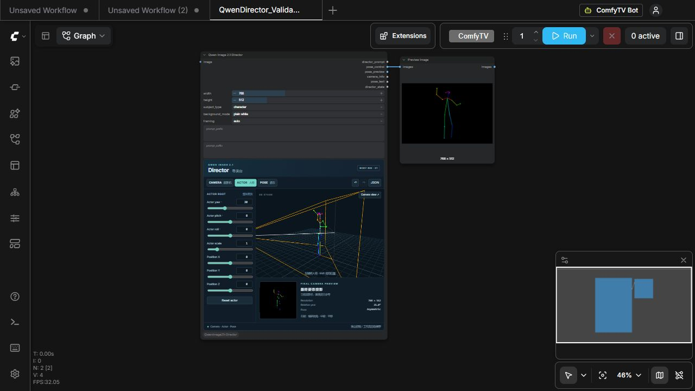
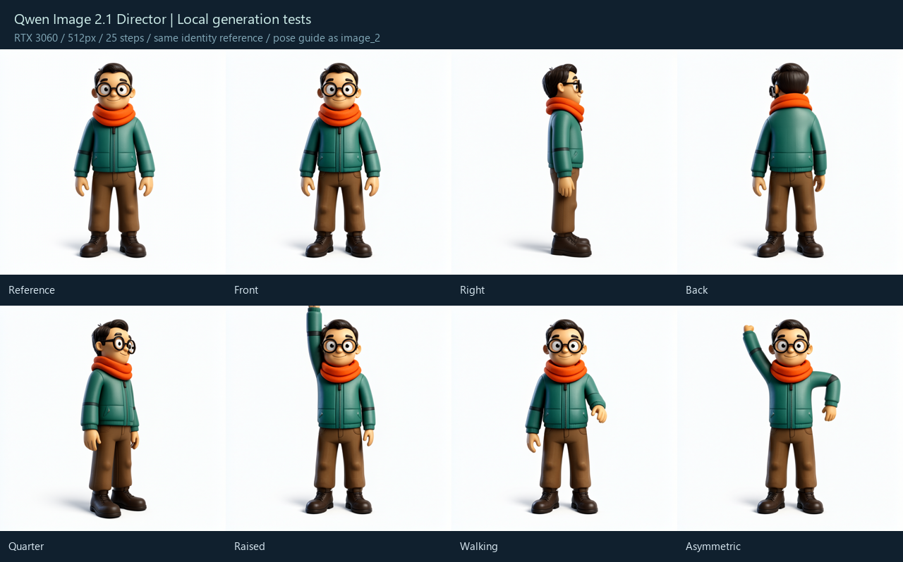

# Validation — 2026-09-28

## Target

Windows / RTX 3060 12 GB; ComfyUI 0.37.0 (`8d534945`), frontend 1.53.6,
Python 3.13.12, PyTorch 2.12.1+cu130. Existing scheduled task:
`ComfyUI 3060 Production`. Restarted through the task after verifying an idle queue.
Installed as a junction from the specified development repository. No Core patch or environment upgrade.

## Automated checks

- Python unittest: 9 tests passed.
- Vitest: 4 tests passed.
- TypeScript / Vue typecheck and Vite production build passed.
- Python vs Three.js: eight viewpoints, non-square aspect ratio, camera roll, translated/scaled/pitched actor and asymmetric FK; corresponding pixel coordinates agree to seven decimal places.
- IK: reachable/unreachable wrist and ankle targets preserve bone lengths, camera and actor root.
- Input validation: unsupported versions, non-finite values, invalid dimensions/joints rejected.
- Render: behind-camera exclusion, near-plane clipping, repeatable float32 image output.

## Production integration

- Node appears in `/object_info/QwenImage21Director`, with all six specified outputs.
- Production browser shows Vue Director and real Three.js stage in the native node.
- API queue passed front / right / back / left / 45° / raised arm / walking / asymmetric cases. Each generated both IMAGE outputs; 512×512 execution approximately 0.05–0.07 s.
- Browser test: camera 45°, actor yaw 20°, Asymmetric pose. State JSON contains camera 45 and actor 20 independently, displaying relative yaw 25°.
- Browser queue produced a 1024×1024 pose image in approximately 0.24 s.
- Saved new workflow `QwenDirector_Validation_20260928`; checked actual file contents. Reloaded the page: actor yaw 20°, relative yaw 25°, Asymmetric and 1024×1024 all restored.
- Imported 768×512 state: native dimension widgets synchronized, save/reload restored the non-square dimensions. DOM widget updates now emit paired canvas change events; changing actor yaw visibly marks the workflow unsaved in frontend 1.53.6.
- Initial integration caught a production Vue build issue (`process.env.NODE_ENV` left in library output); fixed via build-time replacement. Mount uses the actual frontend `nodeCreated` lifecycle and hides the state STRING widget.

## Qwen generation

Reference: locally generated fully clothed explorer toy, teal jacket, orange scarf, brown trousers, glasses.
Models: qwen_image_2.1_int8_convrot, qwen3vl_8b_int8_convrot, qwen_image_2.1_vae_bf16.
Test settings: Euler / simple / CFG 1 / fixed seed 21001 / 25 steps / 512 resolution, with original reference in image_1 and Director pose in image_2.

Results are recorded below after visual inspection. Low resolution smoke tests do not establish general model accuracy or ControlNet compatibility.

| Case | Camera / pose adherence | Identity / outfit |
|---|---|---|
| Front neutral | Front composition retained; near-identical to source, as expected for neutral pose | Glasses, hair, scarf, jacket and trousers retained |
| Right 90° | Clear side profile; numeric angular accuracy was not measured | Strong visual retention |
| Back 180° | Head/torso show back; feet remain partly front-facing, so complete turnaround is imperfect | Scarf/jacket colors retained; hidden-side details invented |
| 45° | Clear three-quarter view | Strong visual retention |
| Raised right arm | Correct arm lifted; hand cropped at top despite guide being in frame | Strong visual retention |
| Walking, front camera | Arm changes visible; leg stride weak/mostly ignored | Strong visual retention |
| Asymmetric | Two arms change differently; requested head/leg changes weak | Strong visual retention |

512 tests completed successfully in approximately 18–22 seconds each. An additional
1024×1024 asymmetric case completed successfully in 86 seconds. These tests used one
stylized toy subject; realistic people and other proportions remain unverified.

After inspection, the prompt engine was changed to explicitly replace the source pose,
name a depth-separated stance as a walking-like stride rather than generic standing,
and request margin around hands/feet for full-body compositions. A 45° walking test is
used to expose the depth-separated legs better than the front projection.

Retests after that prompt change: raised arm (22 s) still cropped the hand at the
top; the 45° walking case (18 s) produced a clear stride with separated legs and
appropriate arm swing while preserving the outfit. Prompt wording alone did not
solve cropping; this remains an explicit model limitation.

